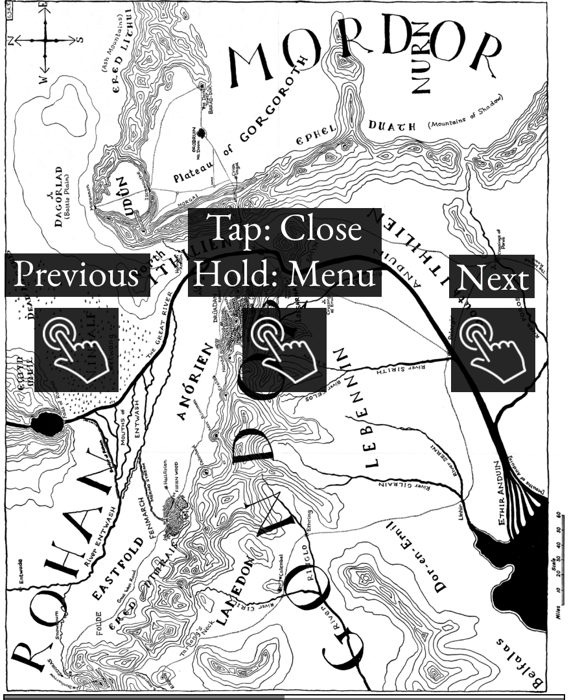
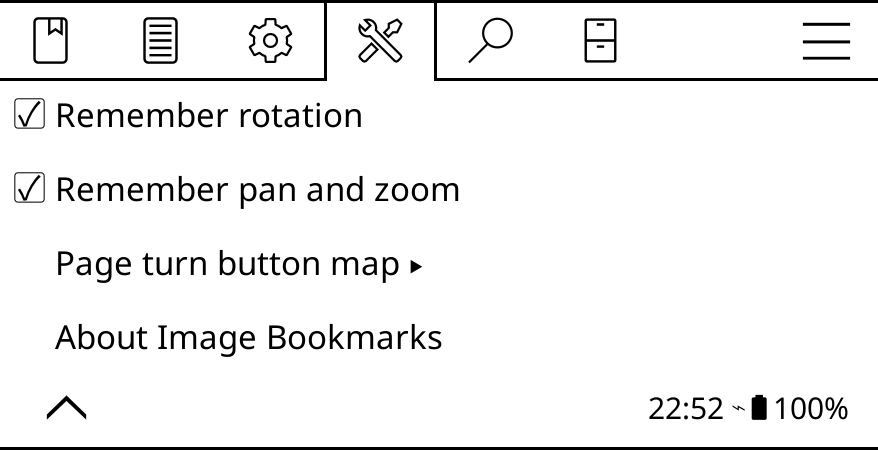
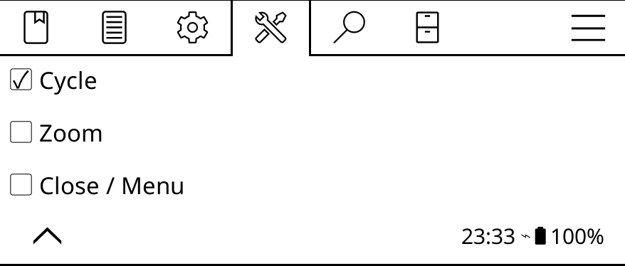

# Image Bookmarks for KOReader

Save and revisit images instantly in KOReader

## Installation

1. Download and extract the latest release: https://github.com/bozo22/imagebookmarks.koplugin/releases/latest
2. Copy the plugin folder `imagebookmarks.koplugin` into KOReader’s `plugins` directory
3. Restart KOReader.

## Usage

### Bookmarking an image

Long-pressing an image will offer an option to bookmark it.

### Viewing bookmarked images

To view saved bookmarks, you need to first assign a gesture to the "Open image bookmark viewer" action:
  1. Top menu /  / Taps and gestures / Gesture manager / [ your preferred gesture ]
  2. Select "Open image bookmark viewer" under "General"

In the viewer:
- **Side tap:** Cycle bookmarks
- **Center tap:** Close viewer
- **Pinch and spread:** Zoom
- **Swipe:** Pan
- **Long press:** Open context menu

In the context menu, you can zoom and rotate, as well as remove and reorder your bookmarks.

## Configuration

The plugin settings are available under: Top menu /  / Image bookmarks.

By default, the plugin remembers the rotation, zoom & pan of your bookmarks, here you can disable this if you wish.

If your device has physical buttons, you can also set their behavior.

